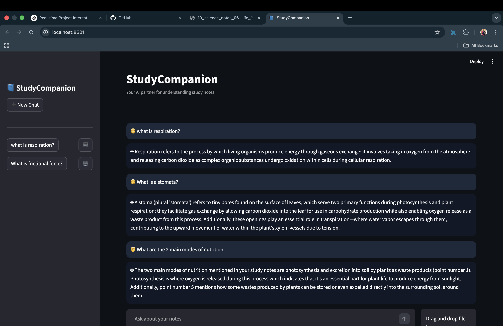
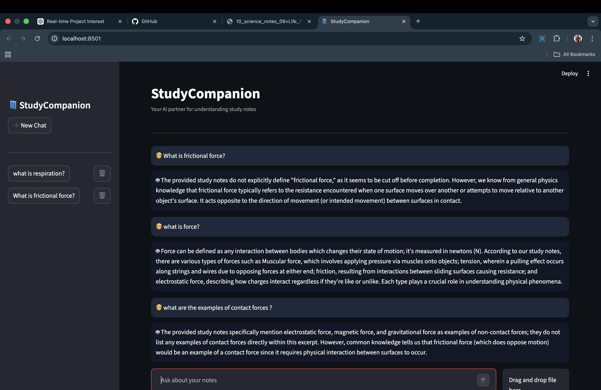

📘 StudyCompanion
Your AI Partner for Understanding Study Notes

StudyCompanion is an AI-powered study assistant that allows students to upload their study notes (PDF files) and ask questions about the content.
The system retrieves relevant information from the notes and generates clear explanations using a language model.

This project demonstrates a Retrieval-Augmented Generation (RAG) pipeline similar to modern AI tools like ChatGPT, Perplexity AI, and Claude for documents.

🚀 Features

📄 Upload study notes in PDF format

💬 Ask questions about the document

🧠 AI answers based on the uploaded notes

🗂 Multiple chat sessions

⚡ Semantic search using embeddings

💻 Runs locally (no paid API required)

🏗 System Architecture

StudyCompanion uses a Retrieval-Augmented Generation (RAG) architecture.

flowchart TD

A[User Uploads PDF] --> B[PDF Text Extraction]
B --> C[Text Chunking]
C --> D[Embedding Generation]

D --> E[Vector Database FAISS]

F[User Question] --> G[Question Embedding]

G --> E

E --> H[Retrieve Relevant Context]

H --> I[Language Model Phi-3]

I --> J[Generated Answer]

J --> K[Streamlit Chat Interface]

The system retrieves relevant sections from the document before generating an answer.

🛠 Tech Stack

| Component            | Technology               |
| -------------------- | ------------------------ |
| Programming Language | Python                   |
| UI Framework         | Streamlit                |
| Embeddings Model     | Sentence Transformers    |
| Vector Database      | FAISS                    |
| Language Model       | Microsoft Phi-3 Mini     |
| PDF Processing       | PyPDF                    |
| ML Framework         | HuggingFace Transformers |

📂 Project Structure

ai-learning-companion
│
├── dashboard
│   └── app.py                # Streamlit application
│
├── src
│   ├── pdf_reader.py         # PDF text extraction
│   ├── vector_store.py       # FAISS vector search
│   ├── qa_system.py          # LLM question answering
│
├── images                    # Screenshots for README
│
└── requirements.txt

⚙️ Installation

1️⃣ Clone the repository
git clone https://github.com/Diya-k-d/StudyCompanion.git
cd study-companion-ai

2️⃣ Create a virtual environment

python -m venv venv
source venv/bin/activate

3️⃣ Install dependencies

pip install -r requirements.txt

4️⃣ Run the application

streamlit run dashboard/app.py

4️⃣ Run the application

http://localhost:8501

💬 Example Usage

Upload a PDF containing study notes and ask questions like:

What is force?
Explain respiration.
What are the types of forces?
Summarize this chapter.

The system retrieves relevant text from the document and generates an explanation.

⚠️ Challenges Faced During Development

During development several real-world AI engineering challenges were encountered.

1️⃣ Context Retrieval Issues

Sometimes the system retrieved incorrect paragraphs for a question.

Example:

Question: What is force?
Retrieved: Types of forces paragraph

Solution

Improved chunking strategy

Used cosine similarity search

Retrieved multiple relevant chunks

2️⃣ Model Hallucinations

Small language models sometimes generate incorrect information.

Example:

Friction is a non-contact force

Solution

Prompt engineering

Limiting model creativity

Restricting answers to the provided context

3️⃣ Slow Model Loading

The Phi-3 model (~7GB) requires time to load.

Solution

Cached the model using Streamlit

Loaded the model only once per session

4️⃣ Chat State Management

Earlier versions mixed PDFs between chats.

Solution

Stored vector indexes separately per chat

Used unique session state keys

⚠️ Limitations

This project uses free open-source models running locally, which introduces some limitations.

Smaller Model Size

Phi-3 Mini is significantly smaller than models used in commercial AI systems such as:

GPT-4

Claude

Gemini

Smaller models have lower reasoning ability and may generate less accurate answers.

Limited Context Window

The model cannot process entire documents at once, so the text must be split into smaller chunks.

Hardware Constraints

Running AI models locally requires sufficient RAM or GPU acceleration. Performance depends on the user's system.

🔮 Future Improvements

This project can be expanded with several improvements.

Better Language Models

Using larger models such as:

GPT-4

Claude

Gemini

Llama-3

would significantly improve answer quality.

Hybrid Search

Combine:

Semantic search

Keyword search

to improve retrieval accuracy.

Reranking Models

Use cross-encoder reranking models to select the most relevant context.

Multi-Document Knowledge Base

Allow users to upload multiple PDFs and search across them.

Source References

Highlight the exact paragraph used to generate the answer.

Faster Inference

Use optimized frameworks such as:

vLLM

llama.cpp

Ollama

## 📸 Demo

### Application Interface

### Chat Example

📚 Learning Outcomes

Through this project I gained experience in:

Retrieval-Augmented Generation (RAG)

Vector databases (FAISS)

Prompt engineering

Building AI-powered applications

Integrating LLMs with real-world data

Designing conversational interfaces

👩‍💻 Author

Diya K D

Data Science | Artificial Intelligence | Machine Learning

GitHub
https://github.com/Diya-k-d

